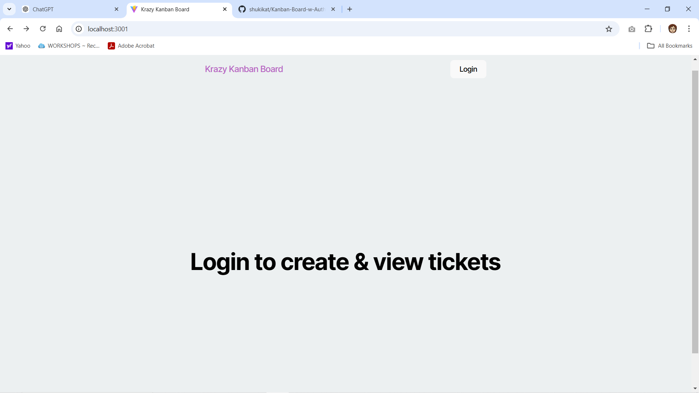
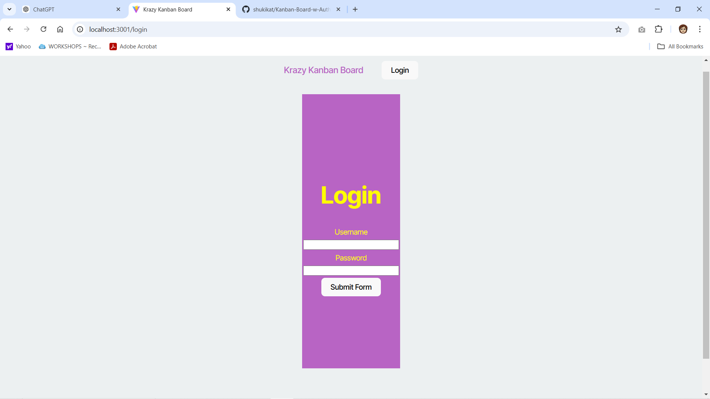
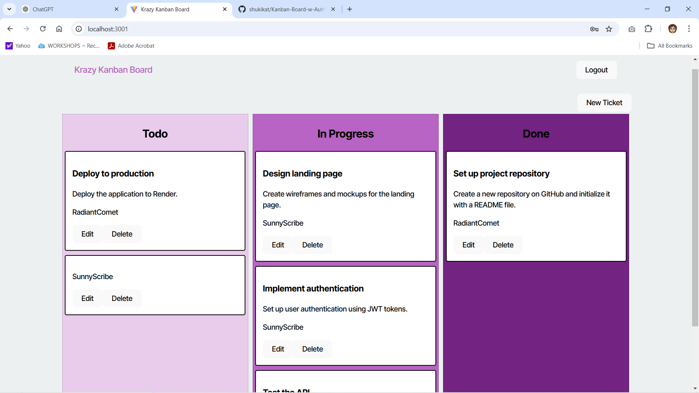
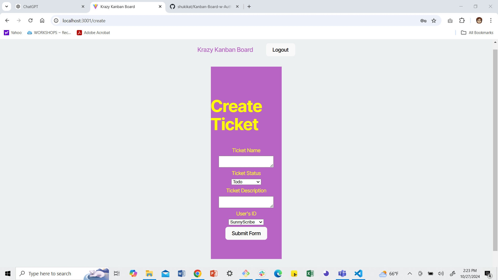

# Kanban-Board-w-Auth
This is a project to allow access to a Kanban board with valid credentials using a JWT token. 

## Description

This is a full stack application that is built with React, Node.js., and sequelize. In this application, you are presented with a login to a Kanban board. The user must enter both a valid username and password to access the Kanban board. If either username and/or password is invalid they are not allowed access to the Kanban Board. Valid user information is stored in the Users table of the Kanban_DB. 
When authenticated user is logged into the Kanban Board application and their token to access the site is stored into local storage. The user is then able to access the Kanban board, create new tickets, edit, and delete existing tickets. When the user logs out their access token is removed from local storage and they are directed back to the home screen. 

## Screenshots

## Installation

This project is build using React. To run and initiate the app the user must install:

 * `npm install vite --save-dev`
 * `npm install react react-dom`
 * `npm install bcrypt`
 *  `npm install sequelize`
 * `npm install jsonwebtoken`
 

## Usage 

To run this project:

* Open the command line.
* Navigate to the directory of your project that contains the `package.json` file that runs the both the client and server side (In this Project the app is run from the Develop directory)
* Run the command `npm start` (this may vary based on specifics in your `package.json` scripts). 

 From the the Home Screen:
     * Click the Login button.
     * Input valid user name and password.
     * Click on the "Submit Form" button.

From the Krazy Kanban board page you can:
     * View existing tickets on the Kanban board.
     * Click "Edit" on one of the tickets to edit status and the information.
     * Click "Delete" and delete the ticket.
     * Click on "New Ticket" button to add a ticket. 
     * Click on "Logout" button to logout of the application. 
    

    

## License

This project includes the MIT License.

## Contributions

This project was quite a challenge for me and I received  a great deal of assistance from the Xpert Learning Assistant tool available through my Columbia Engineering Bootcamp account and ChatGPT. These tools helped guide me through some difficulties, including error handling, evaluating code quality,  correcting typescript errors, and evaluating corrections needed for my READme. In addition, I had a NUMBER of issues with my commits and file compatability when trying to deploy the app on Render.  I also used Activity 25 JWT Authentication from my Full Stack React lesson in my course work as a reference. The code in the noted activity served as an EXTREMELY valuable resource. 

 This repository is available to the public. Please feel free to clone this repository, submit a pull request, and add any issues. You can contact me via GitHub or email!

* [Link to Kanban-Board-w-Auth repository](https://github.com/shukikat/Kanban-Board-w-Auth)

* [My Email](mailto:kathuriashuki@gmail.com)

## Tests

Example Test Cases:

On Home Page:
* Click "Login" button to access login form. 
* Verify that the secret token is saved in local storage after logging in. 
* Input valid credentials to ensure access to the Kanban Board page. 
* Input invalid credentials and check that you remain on the login page.

On Kanban Board page:
* Verify existing tickets are visible. 
* Edit a ticket and confirm the changes. 
* Delete the ticket and verify the ticket is deleted. 
* Create a new ticket and verify it appears on the board. 
* Logout and ensure you are directed back to Home Screen with the token removed  from local storage.

